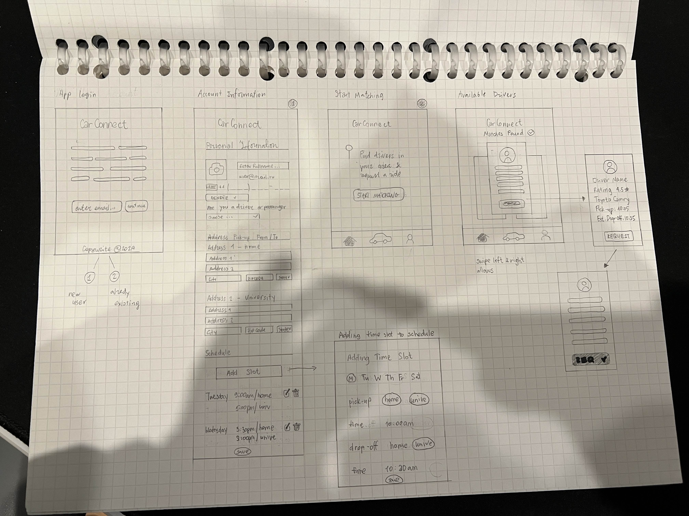
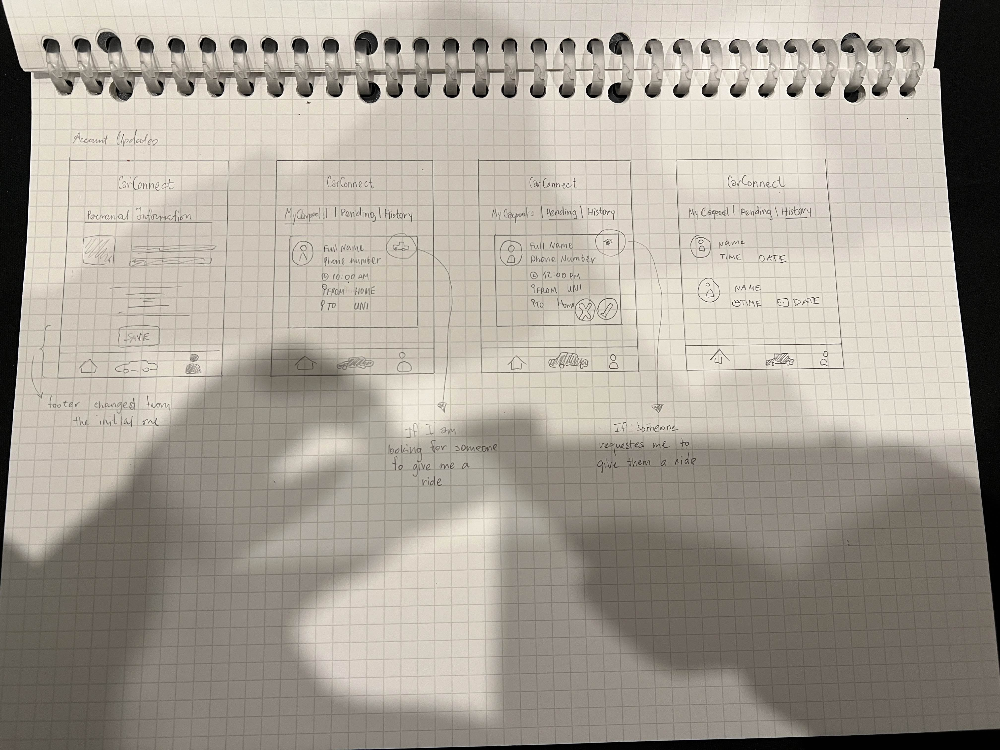
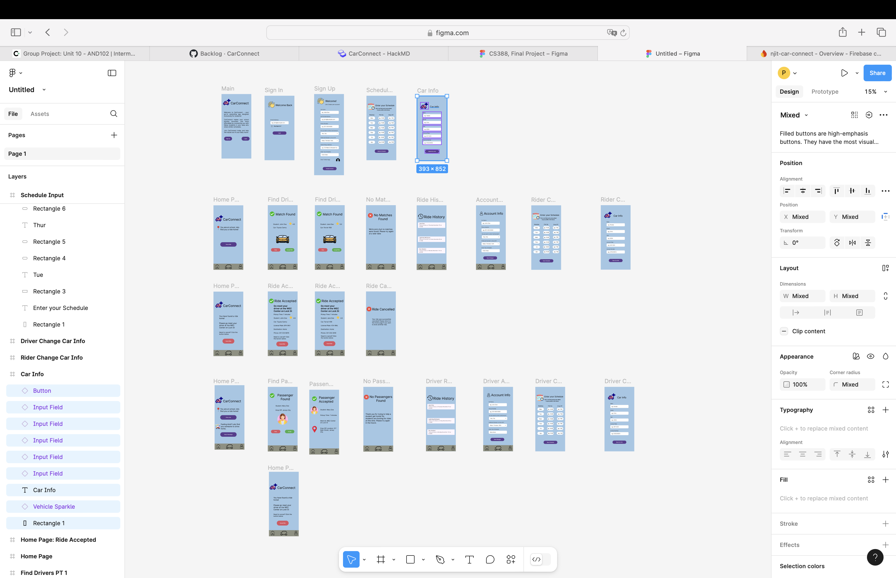

# Car Connect
An android application that helps students to find Carpool to get to the campus.

## Important External Links

- [Project Managment (Kanban)](https://github.com/users/palina-pauliuchenka/projects/18/views/1)
- [HackMD](https://hackmd.io/s/rkKy8cQ7ye)

## Table of Contents

1. [Overview](#Overview)
1. [Product Spec](#Product-Spec)
1. [Wireframes](#Wireframes)

## Overview

### Description

An android application that helps students to find Carpool to get to the campus and back.

#### Problem Statement
College students often experience significant financial hardship and face significant student loan debt after graduation. For the 85% of students that commute to campus, these financial challenges are advanced by the rising cost of transportation, gas, vehicle maintenance, parking and public transportation fares. These key factors highlight a need for affordable, student-focused car sharing platform. Along with reducing travel expenses, commuting students miss out on the possibilities to engage in on campus events or build connections with classmates. A reliable carpooling solution could provide more opportunities for commuting students to build connections. It also offers a safer commuting option, especially for those traveling late at night. Therefore, students need a carpooling service that is affordable, promotes community, and is designed with safety and convenience in mind.

#### High Level Vision
Our platform, CarConnect, addresses the financial and social challenges faced by commuting college students by providing a secure, affordable, and practical carpooling solution. Through CarConnect, students can connect with peers in nearby locations, facilitating organized and reliable shared transportation options. This approach reduces individual transportation costs and supports safer commuting, especially during late hours. CarConnect is dedicated to enhancing accessibility and building a supportive campus community, where students can experience a shared journey that fosters both safety and connection.

### App Evaluation

[Evaluation of your app across the following attributes]
- **Category:**
- **Mobile:**
- **Story:**
- **Market:**
- **Habit:**
- **Scope:**

## Product Spec

### 1. User Features (Required and Optional)

**Required Features**

1. User registration / login
2. Add schedule
3. Request a ride
4. Driver accept the request
5. Match with driver pop-up
6. Edit schedule

**Optional Features**

1. Driver side off the app
2. Ride History
3. ...

### 2. Screen Archetypes

- Sign-up / Login screen
  - First time users or returning users are welcomed with the screen to enter their email. Email with the login link will be sent out immediately, it will provide a security, confirming `.edu` email meaning that only students can participate in the carpool or any stuff members.
    - first time users after successful login will be welcomed with the screen to finish set-up their account.
    - returning users will be welcomed with the first screen to request a ride. Also, returning users will be requested to relogin once in 4 month to confirm they are still a student.
- Main Screen
  - Request Ride
- User Account / Profile
  - Edit schedule
  - Logout
  - Delete Account

### 3. Navigation

**Tab Navigation** (Tab to Screen)

* Home
* History (out-of scope)
* User Account / Profile

**Flow Navigation** (Screen to Screen)

- Home Icon
  - takes user to the main screen where most upcoming ride is displayed (only one)
  - user is able to find new matches for carpool.
- Car Icon
  - upcoming rides / scheduled rides including recurring
  - past ride history
- User Account icon
  - takes to edit user account, schedule and car information if needed.

## Wireframes

 

 

### [BONUS] Digital Wireframes & Mockups

### [BONUS] Interactive Prototype
Link to the [gif](https://drive.google.com/file/d/1z6ON4MYPO6cLzbcew78coQjVATJ2Lc8p/view?usp=share_link) that displays figma prototype.

 
>>>>>>> 749e0eb (initial commit)
