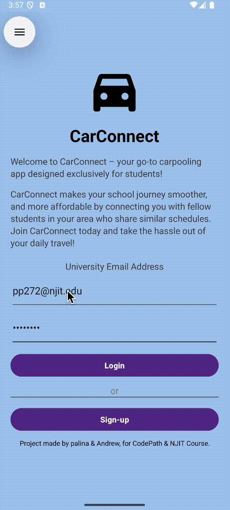

# Car Connect
An android application that helps students to find Carpool to get to the campus.

## Important External Links

- [Project Managment (Kanban)](https://github.com/users/palina-pauliuchenka/projects/18/views/1)
- [HackMD - Overview](https://hackmd.io/@car-connect/Bkm0vc77kx)
- [HackMD - Brainstorming](https://hackmd.io/@car-connect/SyYqO5Q7kl)

## Table of Contents

1. [Overview](#Overview)
1. [Product Spec](#Product-Spec)
1. [Wireframes](#Wireframes)

## Overview

### Description

An android application that helps students to find Carpool to get to the campus and back.

#### Problem Statement
College students often experience significant financial hardship and face significant student loan debt after graduation. For the 85% of students that commute to campus, these financial challenges are advanced by the rising cost of transportation, gas, vehicle maintenance, parking and public transportation fares. These key factors highlight a need for affordable, student-focused car sharing platform. Along with reducing travel expenses, commuting students miss out on the possibilities to engage in on campus events or build connections with classmates. A reliable carpooling solution could provide more opportunities for commuting students to build connections. It also offers a safer commuting option, especially for those traveling late at night. Therefore, students need a carpooling service that is affordable, promotes community, and is designed with safety and convenience in mind.

#### High Level Vision
Our platform, CarConnect, addresses the financial and social challenges faced by commuting college students by providing a secure, affordable, and practical carpooling solution. Through CarConnect, students can connect with peers in nearby locations, facilitating organized and reliable shared transportation options. This approach reduces individual transportation costs and supports safer commuting, especially during late hours. CarConnect is dedicated to enhancing accessibility and building a supportive campus community, where students can experience a shared journey that fosters both safety and connection.

### App Evaluation

- **Category:** Car Sharing / Transportation
- **Mobile:** Primarily a mobile-first platform with a user-friendly phone application designed for easy ride organization and communication.
- **Story:** CarConnect allows college students to organize or join carpools, helping them reduce transportation costs and build connections with peers. It emphasizes affordability, safety, and fostering community by providing a secure way to share rides to campus and back.
- **Market:** Targeted towards off-campus college students who commute to campus regularly. It is particularly appealing to students looking to save on transportation costs, travel safely, and expand their social network by meeting fellow students.
- **Habit:** Students can frequently use the app to organize or join rides daily or weekly, depending on their class schedules. The app encourages regular engagement through features like recurring ride schedules, in-app notifications for ride availability, and incentives for consistent usage (e.g., cost-sharing summaries or badges for frequent carpoolers).
- **Scope:** Initially focused on connecting students for basic campus commutes, the app can expand to include additional features  such as `(out of our scope)`:
  - Real-time ride tracking.
  - Advanced scheduling options for group trips.
  - Integration with campus event schedules for better accessibility to events.
  - Partnerships with universities to provide exclusive perks, such as discounted parking for carpool participants or integration with student IDs.

## Product Spec

### 1. User Features (Required and Optional)

**Required Features**

1. User registration / login
2. Add schedule
3. Request a ride
4. Driver accept the request
5. Match with driver pop-up
6. Edit schedule

**Optional Features**

1. Driver side off the app
2. Ride History
3. Map Navigation

### 2. Screen Archetypes

- Sign-up / Login screen
  - First time users or returning users are welcomed with the screen to enter their email. Email with the login link will be sent out immediately, it will provide a security, confirming `.edu` email meaning that only students can participate in the carpool or any stuff members.
  - first time users after successful login will be welcomed with the screen to finish set-up their account.
  - returning users will be welcomed with the first screen to request a ride. Also, returning users will be requested to relogin once in 4 month to confirm they are still a student.
- Main Screen
  - Request Ride
- User Account / Profile
  - Edit schedule
  - Logout
  - Delete Account

### 3. Navigation

**Tab Navigation** (Tab to Screen)

* Home
* History (out-of scope)
* User Account / Profile

**Flow Navigation** (Screen to Screen)

- Home Icon
  - takes user to the main screen where most upcoming ride is displayed (only one)
  - user is able to find new matches for carpool.
- Car Icon
  - upcoming rides / scheduled rides including recurring
  - past ride history
- User Account icon
  - takes to edit user account, schedule and car information if needed.

## Wireframes

 

 

### [BONUS] Digital Wireframes & Mockups

### [BONUS] Interactive Prototype
### Link to the **[gif](https://drive.google.com/file/d/1z6ON4MYPO6cLzbcew78coQjVATJ2Lc8p/view?usp=share_link)** that displays figma prototype.

# Milestone 2 - Build Sprint 1 (Unit 8)

## GitHub Project board

[Add screenshot of your Project Board with three milestones visible in
this section]
!(https://hackmd.io/_uploads/Hyl9_C3XJe.png)

## Issue cards

- [Add screenshot of your Project Board with the issues that you've been working on for this unit's milestone] 
- [Add screenshot of your Project Board with the issues that you're working on in the **NEXT sprint**. It should include issues for next unit with assigned owners.] 

## Issues worked on this sprint

- List the issues you completed this sprint
- [Add giphy that shows current build progress for Milestone 2. Note: We will be looking for progression of work between Milestone 2 and 3. Make sure your giphys are not duplicated and clearly show the change from Sprint 1 to 2.]

 

## Issue cards

## Issues worked on this sprint

- Issues 1 through 7, 15, 19

# Milestone 3 - Build Sprint 2 (Unit 9)

## GitHub Project board

## Completed user stories

- Account registration
- Account login
- Profile Creation
- Driver Side
- Passenger Side
- Matching Driver with Passenger
- Matching Passenger with Driver
- Ride history view
- Update profile information
- Accept or deny rides / passengers

Account login for the first timers, gives an error as registration first is required.

Account registration + profile form fill out.

After creating an account user has to confirm student email.

Account Login after successful registration.

Finding a ride, accepting the match, showing the history.

After user updated their profile, and selected "yes" in the dropdown for offering to carpool student. He is able to look for rides and passengers, this gif showcases how driver matches with the passenger.

## App Demo Video

- Embed the YouTube/Vimeo link of your Completed Demo Day prep video

